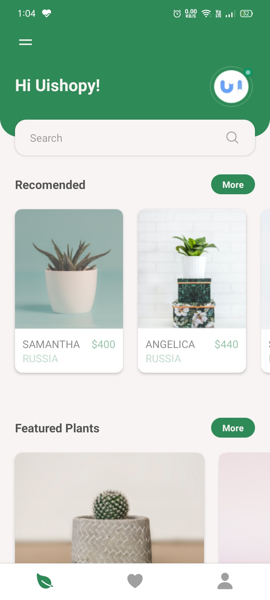
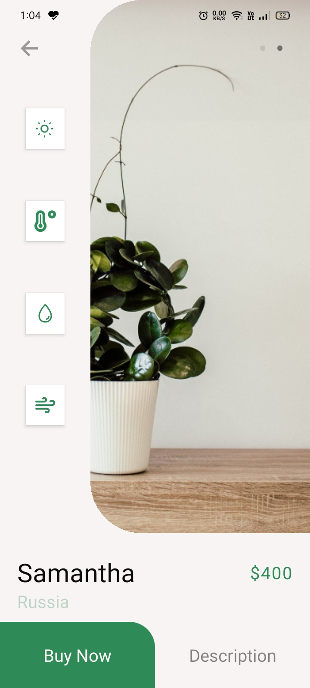

# Plant App UI

## React Native

### Maintainer: [@tarung10](http://github.com/tarung10)

## Demo

  
  

## Usage

1. `git clone https://github.com/revokanecommunity/plant_app_ui.git`
2. `cd plant_app_ui`
3. `yarn`
4. `expo start -c`

[Tutorial](https://youtu.be/nYg0Mn4jOQE)

[Download APK](https://github.com/revokanecommunity/plant_app_ui/releases/download/1/plant_app_ui.apk)
